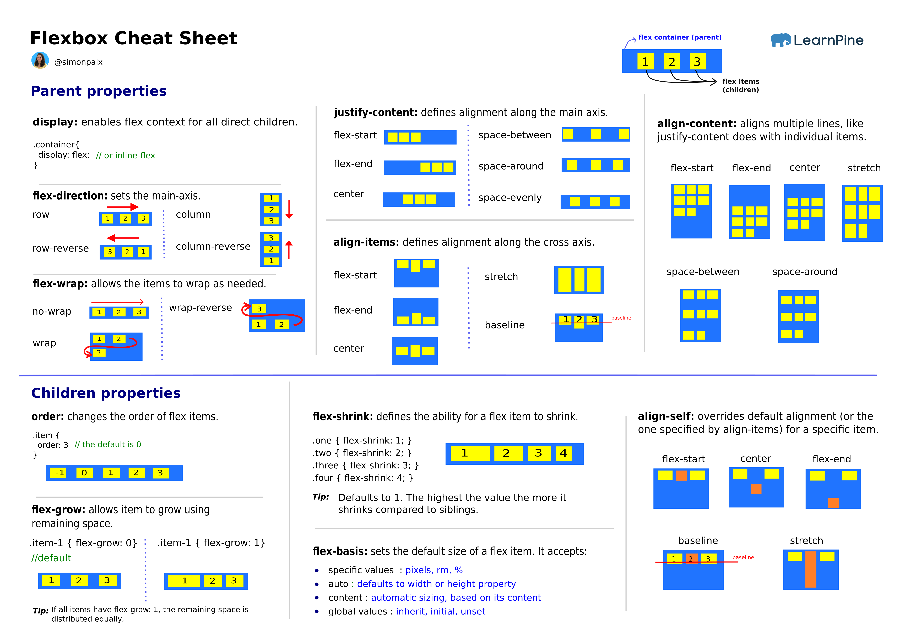
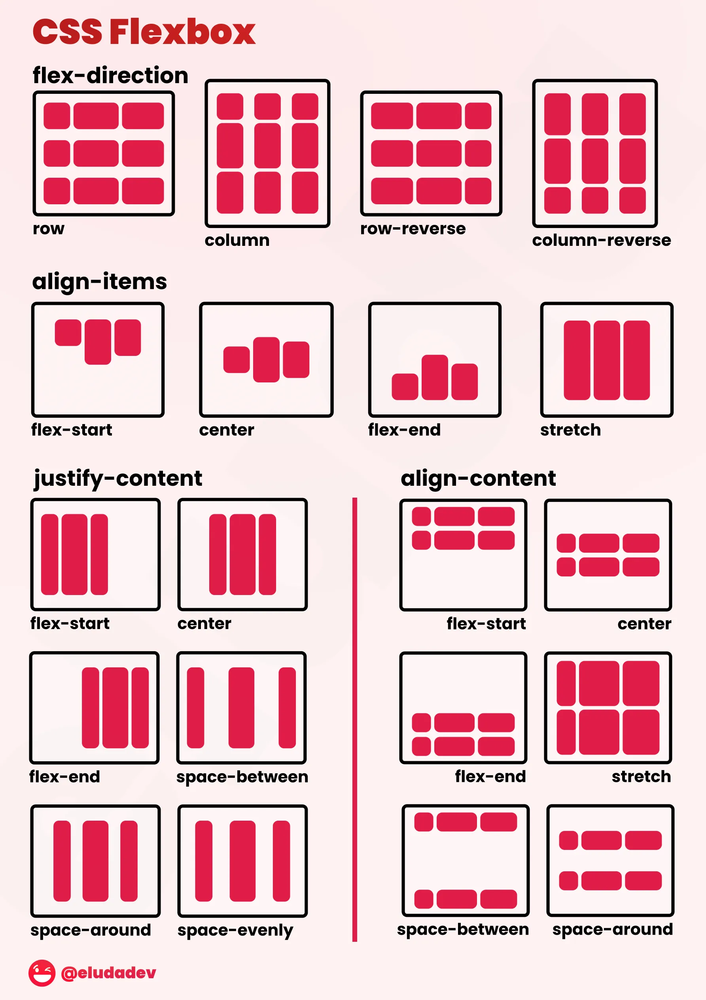

# FlexBox Usage:

Flexbox is a perfect solution for one dimensional layout.

Learn More: [**Visualized Concepts**](https://marina-ferreira.github.io/tutorials/css/flexbox/)

Simulator: [**Flex Box Simulator**](https://www.cssportal.com/css-flexbox-generator/)

# Flex Box Model

# Flex Box Usage:
- Use class name `flex` to make flex container.
- Alignment accross x axis can be achieved with: ``justify-<center/start/end/around/evenly>``
- Items placement (accross y axis) can be controlled with: ``items-<start/end/center/baseline>``, [Reference](https://tailwindcss.com/docs/align-items)

> Note that, x (main axis) and y axis (cross axis) depends on weather we set flex as row or column.

# Cheatsheet

