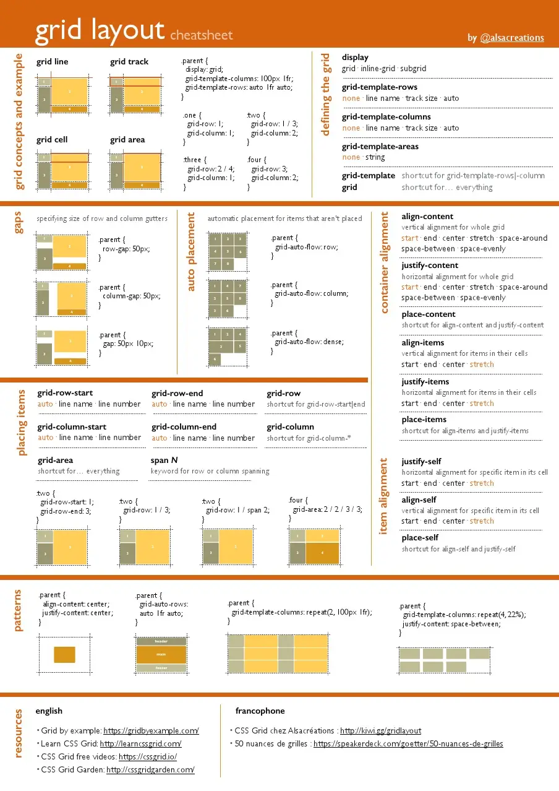

# CSS Grid Box

- Grid is a 2 dimensional layout system.

- Allows us to define rows and columns, and position elements within a grid.

## Tailwind Grid Docs:

- [Grid Template Columns](https://tailwindcss.com/docs/grid-template-columns)

- [Grid Column Start / End](https://tailwindcss.com/docs/grid-column)

- [Grid Template Rows](https://tailwindcss.com/docs/grid-template-rows)

- [Grid Row Start / End](https://tailwindcss.com/docs/grid-row)

- [Grid Auto Flow](https://tailwindcss.com/docs/grid-auto-flow)

- [Grid Auto Columns](https://tailwindcss.com/docs/grid-auto-columns)

- [Grid Auto Rows](https://tailwindcss.com/docs/grid-auto-rows)

- [Gap](https://tailwindcss.com/docs/gap)

## Cheatsheets

> All credit goes to image author.
